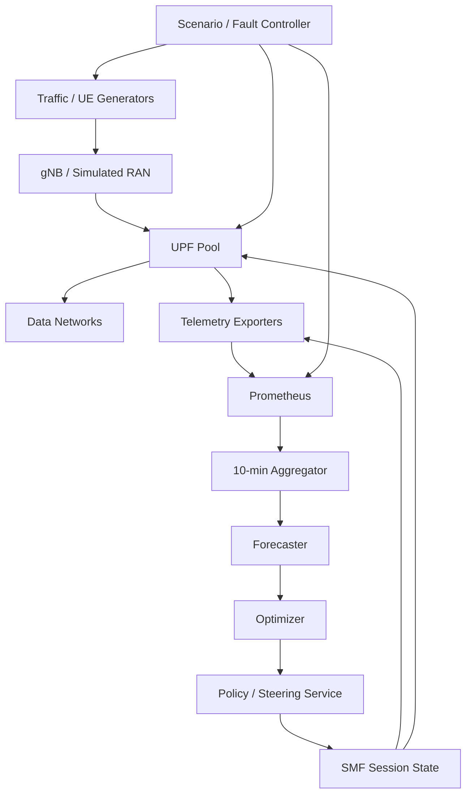

# C-DOT UPF Traffic Management: Simulation, Synthetic Data Generation, and Closed-Loop Demo Architecture

**Version:** 1.0  
**Date:** 4 August 2026  
**Purpose:** Technical implementation blueprint for generating realistic UPF traffic-management data on the C-DOT HPC cluster and demonstrating forecast-driven UPF traffic steering.

---

## 1. Executive Summary

The goal is to build an experimental platform that can be used **before sufficient C-DOT production history is available**, while remaining structurally compatible with the real C-DOT telemetry and control interfaces when they become available.

The platform should answer two questions:

1. **Simulation/data question:** Can we generate realistic time-series data containing per-UPF throughput, sessions, DNN/S-NSSAI/5QI/zone dimensions, topology, capacity, failures, compute metrics, and traffic events?
2. **Closed-loop question:** Can a forecaster predict the next 10-minute demand window and an optimizer convert that forecast into a traffic-steering policy that prevents UPF overload?

The recommended design is **multi-fidelity** rather than one monolithic simulator:

- **High-fidelity 5G-core testbed:** `free5GC` + `PacketRusher` or `UERANSIM` + multiple real software UPFs + Linux/eBPF/TC telemetry + Prometheus.
- **Radio/traffic realism layer:** `ns-3 + 5G-LENA` for 5QI-aware traffic, RAN effects, mobility, QoS, mixed NGMN workloads, XR, HTTP, FTP, gaming, video and VoIP.
- **Fast macro simulator:** a custom C++ simulator (recommended for the large campaign) or a Python/SimPy prototype that models sessions, flows, UPF capacities, queues, failures, locality, routing and control at 15–30 s or 10-minute granularity.
- **HPC execution:** use the 160 standard nodes as an embarrassingly parallel scenario factory; use the 32 TB shared-memory node for global aggregation, very large state/graph experiments, large optimization jobs, or in-memory analysis.
- **Closed-loop demo:** Prometheus → 10-minute feature aggregation → forecaster → optimizer → steering controller → SMF/UPF selection → new PDU sessions → telemetry feedback.

For the first demo, traffic steering should operate on **new PDU-session placement**, not arbitrary packet-by-packet load balancing and not live migration of already anchored sessions. This is the lowest-risk path to a technically correct 5G-aware demonstration.

---

# Part I — What Exactly Must Be Simulated?

## 2. Requirements Derived from the C-DOT Data Request

The supplied C-DOT data-request email defines a 10-minute decision cycle:

1. Prometheus continues scraping telemetry at a fine interval, ideally **15–30 seconds**.
2. Fine-grained values are aggregated into one value per metric/traffic group/10-minute bucket.
3. A forecaster predicts the **next 10-minute demand window**.
4. An optimizer uses predicted demand, UPF capacity, topology and eligibility constraints to produce a recommended distribution across UPFs.

The synthetic environment therefore needs to generate the same conceptual information expected from the real system.

### 2.1 Required telemetry

At minimum:

- per-UPF N3 throughput
  - UL packet counters
  - DL packet counters
  - UL byte counters
  - DL byte counters
- per-UPF N6 throughput
- active PDU-session count per UPF
- traffic dimensions where applicable:
  - DNN
  - S-NSSAI / slice
  - 5QI or traffic class
  - zone/site/location
- timestamps and units
- missing-sample indicators
- counter-reset indicators
- UPF restart/failure indicators

### 2.2 Required configuration/state

- UPF identifier
- UPF site/zone
- nominal maximum throughput
- maximum sessions
- recommended operating threshold
- available N3/N6/N9 connectivity
- topology between RAN, UPFs and data networks
- eligibility matrix such as:

\[
E_{z,c,u} \in \{0,1\}
\]

where `E[z,c,u] = 1` means traffic group `c` in zone `z` may use UPF `u`.

### 2.3 Optional but highly valuable measurements

- UPF CPU utilization
- UPF memory utilization
- queue occupancy
- packet-processing utilization
- packet drops
- PFCP session counts
- PDU-session establishment latency
- RTT / path latency

### 2.4 Traffic-generation capabilities

The simulator must support more than flat random load. It should include:

- daily patterns
- weekday/weekend differences
- stochastic bursts
- different demand per DNN/slice/5QI/zone
- scripted crowd events
- mobility-driven changes between zones
- UPF failures/restarts
- topology/link degradation
- telemetry gaps and delayed observations

---

# Part II — Recommended Multi-Fidelity Simulation Stack

## 3. Why One Simulator Is Not Enough

There are two conflicting objectives:

### Objective A — Protocol fidelity

We need real concepts such as:

- N2 / NGAP
- N3 / GTP-U
- N4 / PFCP
- PDU sessions
- SMF selection
- UPF state
- DNN
- S-NSSAI
- 5QI/QoS
- ULCL / multi-UPF paths

A real open-source 5G core is best for this.

### Objective B — statistical scale

We also want:

- many simulated weeks/months
- millions of traffic conditions
- thousands of topologies/capacity configurations
- rare failures
- many random seeds
- large optimizer comparisons

Packet-level 5G emulation is unnecessarily expensive for this.

Therefore:

```text
                HIGH FIDELITY                        HIGH SCALE

 UE/RAN simulator -> real 5GC -> real UPF        fast event/flow simulator
         |                    |                           |
         |                    |                           |
         +---- calibration ---+---------------------------+
                              |
                              v
                     unified data schema
```

The fast simulator should be **calibrated against high-fidelity experiments**, not invented independently.

---

## 4. Component Selection

## 4.1 Primary 5G core: free5GC

**Recommendation for Phase 1: free5GC.**

Reasons:

- 5G Standalone core
- SMF + UPF + PFCP
- N3/N4/N6/N9
- multiple UPFs
- multiple slices and DNNs
- ULCL
- PDU Session Modification
- configurable user-plane topology
- UPF selection by S-NSSAI / topology
- Traffic Influence through UDR/NEF

The SMF configuration explicitly represents user-plane nodes and links, which maps naturally to the optimizer's topology and eligibility constraints.

### Documented reference

- free5GC features: https://free5gc.org/guide/features/
- free5GC SMF/user-plane topology: https://free5gc.org/guide/SMF-Config/
- free5GC Traffic Influence: https://free5gc.org/guide/8-traffic-influence/

### Important implementation distinction

free5GC provides mechanisms for topology selection and Traffic Influence, but the proposed optimizer emits **continuous allocation weights**, for example:

```json
{
  "group": {
    "zone": "zone-a",
    "snssai": "1-010203",
    "dnn": "internet",
    "5qi": 9
  },
  "weights": {
    "upf-1": 0.10,
    "upf-2": 0.55,
    "upf-3": 0.35
  }
}
```

An arbitrary weighted new-session selector is not assumed to exist as a standard free5GC API. **Phase 1 should therefore add a small custom policy hook in/near the SMF** that consumes optimizer weights and chooses among eligible UPFs for new sessions.

Traffic Influence/ULCL is a separate mechanism and becomes useful in later phases for application-aware or active-flow routing.

---

## 4.2 Alternative core: OpenAirInterface 5GC

OAI is a strong second platform after the first prototype works.

The current OAI core advertises:

- multiple UPFs
- ULCL
- slicing
- QoS
- NWDAF
- NEF/event-exposure work
- multiple UPF implementations
  - simple-switch
  - eBPF/XDP
  - VPP/DPDK

Reference: https://openairinterface.org/core-network/

Why use OAI later:

- validate that the proposed method is not tied to one open-source core
- benchmark a higher-performance UPF dataplane
- investigate NWDAF integration
- experiment with eBPF/XDP or VPP/DPDK user planes

---

## 4.3 Open5GS: useful for instrumentation experiments

Open5GS is another mature open-source core. Its current Prometheus support covers several control-plane functions, and a JSON information API can expose connected UEs, gNBs and PDU-session information including DNN, S-NSSAI and QoS.

References:

- https://open5gs.org/open5gs/docs/tutorial/04-metrics-prometheus/
- https://open5gs.org/open5gs/docs/tutorial/07-infoAPI-UE-gNB-session-data/

It is useful as:

- an alternative validation core
- a source of observability ideas
- a simpler telemetry experimentation target

---

## 4.4 UE/gNB load generation

### PacketRusher

PacketRusher is a high-performance UE/gNB simulator and 5GC control-plane/user-plane load tester. It supports multiple simulated UEs and gNBs and is appropriate for core-load experiments.

Reference software record: https://zenodo.org/records/14927077

Use PacketRusher when the goal is:

- generate many registrations/PDU sessions
- stress SMF/AMF/core behavior
- generate user-plane load without PHY fidelity
- measure UPF capacity/session scaling

### UERANSIM

UERANSIM implements a simulated 5G-SA UE and gNB and can connect to open-source cores. Its physical radio is intentionally simplified; the radio interface is simulated rather than being a full RF/PHY model.

References:

- https://github.com/aligungr/UERANSIM
- https://github.com/aligungr/UERANSIM/wiki/Configuration

Use UERANSIM for:

- functional integration
- easy end-to-end PDU-session validation
- DNN/slice configuration tests
- small controlled demos

Do **not** use it as the only source of radio/mobility realism.

---

## 4.5 RAN + traffic realism: ns-3 with 5G-LENA

5G-LENA is the recommended source for statistically meaningful RAN and application behavior.

Current features include:

- OFDMA/TDMA NR operation
- 5QI-aware scheduling
- 5QI handling per flow
- independent multi-flow UE support
- QoS-aware scheduling
- NGMN traffic generators
- FTP
- HTTP
- video
- gaming
- VoIP
- 3GPP XR profiles such as VR/AR/cloud gaming

References:

- https://5g-lena.cttc.es/features/
- https://cttc-lena.gitlab.io/nr/html/cttc-nr-traffic-ngmn-mixed_8cc.html

### Important limitation

5G-LENA's core integration uses an LTE/EPC-derived abstraction. It should therefore **not be treated as a faithful replacement for a real multi-UPF 5G core**.

Recommended use:

1. simulate realistic demand/RAN behavior
2. extract statistical traffic models
3. use those distributions to parameterize the fast macro twin or drive traffic into the high-fidelity core

---

## 4.6 Mobility: SUMO + ns-3 when needed

For spatial demand migration, SUMO can provide road mobility and ns-3 can provide communication behavior.

NIST publishes an ns-3 co-simulation gateway that synchronizes ns-3 with external simulators such as SUMO/CARLA.

Reference: https://www.nist.gov/services-resources/software/gateway-co-simulation-using-ns-3

This is optional for Phase 1. Start with synthetic zone transitions first.

---

# Part III — High-Fidelity Testbed

## 5. Minimum High-Fidelity Topology

Start small:

```text
                  +---------------------------+
                  |       free5GC CP          |
                  | AMF NRF SMF PCF UDR NSSF |
                  +-------------+-------------+
                                |
                               N4
                  +-------------+-------------+
                  |             |             |
                UPF-1         UPF-2         UPF-3
                  |             |             |
                 N6            N6            N6
                  |             |             |
                 DN-A          DN-B          DN-C

PacketRusher/UERANSIM gNB
             |
             | N2 -> AMF
             | N3 -> selected UPF
             v
        simulated UEs
```

Initial traffic groups:

```text
Zone-A / eMBB / internet / 5QI-9
Zone-A / low-latency / edge / 5QI-X
Zone-B / eMBB / internet / 5QI-9
Zone-B / IoT / telemetry / 5QI-Y
```

Exact 5QI choices should be based on the traffic/QoS profiles selected for the experiment rather than hard-coded blindly.

---

## 6. Topology and Eligibility Representation

Maintain one canonical topology configuration owned by the experiment controller.

Example:

```yaml
zones:
  zone-a:
    gnbs: [gnb-a1, gnb-a2]
  zone-b:
    gnbs: [gnb-b1, gnb-b2]

upfs:
  upf-1:
    zone: zone-a
    capacity_gbps: 20
    max_sessions: 50000
    safe_utilization: 0.80
  upf-2:
    zone: zone-a
    capacity_gbps: 30
    max_sessions: 75000
    safe_utilization: 0.80
  upf-3:
    zone: zone-b
    capacity_gbps: 25
    max_sessions: 60000
    safe_utilization: 0.80

traffic_groups:
  - id: zone-a-embb
    zone: zone-a
    dnn: internet
    snssai: "1-010203"
    five_qi: 9
    eligible_upfs: [upf-1, upf-2, upf-3]

  - id: zone-b-edge
    zone: zone-b
    dnn: edge
    snssai: "1-112233"
    five_qi: 7
    eligible_upfs: [upf-2, upf-3]
```

This file becomes the bridge between:

- simulator
- optimizer
- steering controller
- demo dashboard

Do not let each subsystem invent its own topology naming.

---

# Part IV — Generating Realistic Demand

## 7. Traffic Process

A useful initial demand model is:

\[
D_{z,c}(t) = B_{z,c}\,S_d(t)\,S_w(t)\,M_{z,c}(t) + E_{z,c}(t) + \epsilon_{z,c}(t)
\]

where:

- `B[z,c]`: baseline traffic level
- `S_d(t)`: daily seasonality
- `S_w(t)`: weekly seasonality
- `M[z,c](t)`: slow regime multiplier
- `E[z,c](t)`: event component
- `epsilon`: residual stochastic variation

### 7.1 Daily seasonality

Use a Fourier representation or empirical spline rather than a single sine wave:

\[
S_d(t) = 1 + \sum_{k=1}^{K}
[a_k\sin(2\pi k t/T_d) + b_k\cos(2\pi k t/T_d)]
\]

This can represent morning, lunch, commuting and evening peaks.

### 7.2 Weekly seasonality

Use separate weekday/weekend multipliers or a periodic 7-day basis.

### 7.3 Regime changes

Use a Markov chain to represent:

- quiet
- normal
- busy
- overloaded/event

This prevents every interval from being independent.

### 7.4 Bursty arrivals

Options:

- Markov-modulated Poisson process
- negative-binomial arrivals
- Hawkes process for self-exciting events

Start with a Markov-modulated Poisson process; add Hawkes behavior only if needed.

---

## 8. Traffic Mix

A traffic group should describe **what kind of traffic is being generated**, not just a bitrate.

Example population:

```yaml
traffic_mix:
  video: 0.30
  web_http: 0.20
  gaming: 0.10
  voip: 0.10
  file_transfer: 0.10
  background: 0.15
  xr: 0.05
```

Use 5G-LENA to estimate distributions of:

- per-session throughput
- packet sizes
- burst durations
- inter-arrival times
- latency sensitivity
- flow duration

Then fit compact distributions that can be sampled by the fast simulator.

---

## 9. Event Library

Every synthetic run should draw from an explicit event catalogue.

### 9.1 Crowd/flash event

Parameters:

```yaml
type: crowd_event
zone: zone-a
start: 20:00
ramp_minutes: 20
duration_minutes: 120
peak_multiplier: 4.0
affected_classes:
  video: 1.0
  web: 0.6
  voice: 0.3
```

### 9.2 UPF degradation

```yaml
type: upf_capacity_degradation
upf: upf-1
start: 12:15
duration_minutes: 45
capacity_multiplier: 0.55
```

### 9.3 Hard UPF failure

```yaml
type: upf_failure
upf: upf-2
start: 16:30
recovery_minutes: 8
```

### 9.4 Link degradation

```yaml
type: path_degradation
src: zone-a
dst: upf-3
latency_add_ms: 15
capacity_multiplier: 0.60
```

### 9.5 Observability failures

Include:

- missing Prometheus scrapes
- stale telemetry
- counter reset
- delayed samples
- incorrect capacity report

This matters because the real optimizer will eventually operate on imperfect measurements.

---

# Part V — UPF and Session Model

## 10. State Variables

For each UPF `u` maintain:

\[
X_u(t) = [B_u(t), S_u(t), Q_u(t), C_u(t), R_u(t), H_u(t)]
\]

where:

- `B`: throughput
- `S`: active sessions
- `Q`: queue/backlog proxy
- `C`: current effective capacity
- `R`: resource utilization
- `H`: health/failure state

For each traffic group `g=(zone,dnn,slice,5QI)` maintain:

\[
D_g(t), A_g(t), L_g(t)
\]

where:

- `D`: offered traffic
- `A`: active sessions
- `L`: measured latency/SLA statistic

---

## 11. Capacity Calibration

Do **not** assign UPF capacity as an arbitrary constant and stop there.

Run a high-fidelity saturation grid.

Independent variables:

- number of sessions
- offered Gbps
- packet-size distribution
- UL/DL mix
- traffic mix
- CPU allocation
- UPF implementation
- number of PFCP sessions

Measure:

- achieved throughput
- packet loss
- CPU
- memory
- queue/backlog
- latency

Then learn or fit:

\[
C^{eff}_u = f_u(N_{sessions}, packet\_mix, CPU, direction, traffic\_mix)
\]

A tree-based regressor or piecewise surface is adequate initially. There is no need for a large neural model.

---

## 12. Fast Queue/Capacity Model

At time step `Δt`:

\[
Q_u(t+\Delta t) = \max\{0, Q_u(t) + A_u(t) - S_u(t)\}
\]

where:

- `A_u(t)` is arriving traffic/work during the interval
- `S_u(t)` is service capacity during the interval

A basic utilization is:

\[
\rho_u(t)=\frac{D_u(t)}{C^{eff}_u(t)}
\]

Use calibrated nonlinear latency rather than assuming latency grows linearly. For example, fit:

\[
L_u = g(\rho_u, Q_u, N_{sessions})
\]

from the high-fidelity experiments.

The macro simulator is responsible for reproducing the **control-relevant behavior**, not every packet.

---

# Part VI — Telemetry Instrumentation

## 13. Why External Dataplane Instrumentation Is Recommended

Do not depend entirely on core-specific Prometheus counters because availability and semantics can differ between implementations/versions.

Use Linux telemetry at the UPF boundary.

```text
                   N3                       N6
 gNB -------------->| UPF |---------------->| DN
              eBPF/TC     eBPF/TC
                 |           |
                 +-----+-----+
                       |
                 telemetry exporter
                       |
                   Prometheus
```

Useful mechanisms:

- TC/eBPF counters
- interface counters
- `node_exporter`
- cAdvisor for containers
- UPF-specific counters where stable
- SMF session information

### Metrics to export

```text
upf_n3_rx_bytes_total{upf,zone,dnn,snssai,five_qi}
upf_n3_tx_bytes_total{upf,zone,dnn,snssai,five_qi}
upf_n6_rx_bytes_total{upf,dnn}
upf_n6_tx_bytes_total{upf,dnn}
upf_active_sessions{upf,zone,dnn,snssai,five_qi}
upf_cpu_utilization{upf}
upf_memory_bytes{upf}
upf_queue_depth{upf}
upf_health{upf}
```

If exact packet classification at all these label combinations is too expensive, retain a minimal label set and keep a separate session table linking TEID/session to metadata.

---

## 14. Canonical Raw Data Schema

Recommended Parquet/Arrow logical schema:

```text
timestamp                    timestamp[ms]
scenario_id                  string
run_seed                     int64
upf_id                       string
zone_id                      string
dnn                          string
snssai_sst                   int16
snssai_sd                    string
five_qi                      int16
n3_ul_bytes_total            int64
n3_dl_bytes_total            int64
n3_ul_packets_total          int64
n3_dl_packets_total          int64
n6_ul_bytes_total            int64
n6_dl_bytes_total            int64
active_sessions              int32
cpu_utilization              float32
memory_utilization           float32
queue_depth                  float32
path_latency_ms              float32
upf_available                bool
counter_reset                bool
sample_missing               bool
current_capacity_mbps        float32
event_id                     string|null
```

### Why Parquet

Prefer Parquet for the HPC-generated corpus because it provides:

- columnar compression
- predicate pushdown
- efficient partitioning
- compatibility with Python/Polars/PyArrow/Spark/DuckDB

Prometheus remains the **online demo telemetry system**; Parquet is the **offline experimental corpus**.

---

## 15. Ten-Minute Aggregation

For a monotonically increasing byte counter `B(t)`, throughput over a window is:

\[
R(t_0,t_1) = \frac{8[B(t_1)-B(t_0)]}{t_1-t_0}
\]

with explicit handling for:

- counter reset
- UPF restart
- missing interval

Per 10-minute bucket store:

```text
window_start
window_end
traffic_group
mean_throughput_mbps
p95_throughput_mbps
max_throughput_mbps
mean_active_sessions
max_active_sessions
mean_cpu
max_cpu
missing_fraction
restart_count
```

The forecaster should consume **completed 10-minute buckets**, not raw 30-second counters.

---

# Part VII — HPC Execution Architecture

## 16. Do Not Build One Giant Simulation

The standard cluster should run many independent scenarios.

Given:

- 160 standard nodes
- 128 CPUs/node
- ~20,480 CPUs total

use a scenario-array model:

```text
                          SLURM
                            |
                    scenario manifest
                            |
       +--------------------+--------------------+
       |                    |                    |
     node 1               node 2              node 160
       |                    |                    |
  seed/scenario        seed/scenario        seed/scenario
  seed/scenario        seed/scenario        seed/scenario
       |                    |                    |
       +--------------------+--------------------+
                            |
                     partitioned Parquet
```

### Recommended execution modes

#### Mode A — high-fidelity campaign

Small number of expensive jobs:

```text
free5GC + PacketRusher/UERANSIM + multiple UPFs
```

Purpose:

- calibration
- protocol validation
- capacity measurement
- failure signatures

#### Mode B — 5G-LENA campaign

Thousands of independent ns-3 jobs.

Purpose:

- traffic/RAN distributions
- QoS behavior
- mobility effects
- traffic-class characterization

#### Mode C — macro simulation campaign

Millions of independent trajectories.

Purpose:

- train forecaster
- test optimizers
- measure rare overloads
- test robustness
- generate long histories

---

## 17. SLURM Campaign Pattern

Example directory structure:

```text
project/
  configs/
    topology.yaml
    traffic_profiles.yaml
    event_profiles.yaml
  manifests/
    campaign_001.parquet
  simulator/
  telemetry/
  optimizer/
  steering/
  output/
    campaign_001/
      shard_00000.parquet
      shard_00001.parquet
      ...
```

Conceptual SLURM array:

```bash
#!/bin/bash
#SBATCH --job-name=upf-sim
#SBATCH --array=0-9999
#SBATCH --cpus-per-task=1
#SBATCH --mem=2G

SCENARIO_ID=${SLURM_ARRAY_TASK_ID}
./fast_upf_sim \
  --manifest manifests/campaign_001.parquet \
  --scenario ${SCENARIO_ID} \
  --output output/campaign_001/
```

For CPU-heavy scenarios, allocate multiple cores per task only if profiling demonstrates speedup. It is usually better to exploit parallelism across independent runs.

---

## 18. Role of the 32 TB Shared-Memory Node

The 32 TB system should not automatically be used as the primary packet simulator.

Potential high-value roles:

1. keep a massive synthetic corpus in memory for interactive analysis
2. build large time-expanded network graphs
3. run large optimization problems across many time steps
4. run shared-memory counterfactual evaluation
5. build huge state-transition datasets
6. perform all-scenario aggregation without repeated distributed shuffles

Example global tensor:

\[
D[t,z,c,u]
\]

can become enormous when `t`, zones, traffic classes, scenarios and UPFs are all expanded.

Because the machine is likely NUMA, benchmark:

- memory placement
- first-touch allocation
- thread affinity
- local/remote NUMA bandwidth

before committing to a shared-memory algorithm.

---

# Part VIII — Forecasting Layer

## 19. Forecast Target

At boundary `t`, predict traffic for the next window:

\[
\hat D_{g,t+1}=F(D_{g,t},D_{g,t-1},...,X_t)
\]

where `g` is a controllable traffic group such as:

```text
(zone, DNN, S-NSSAI, 5QI)
```

Possible features:

- historical throughput
- active sessions
- time of day
- day of week
- event state
- recent growth rate
- UPF utilization
- zone mobility in/out rate

### Baselines first

Always include:

1. last-value
2. seasonal naive
3. moving average
4. exponential smoothing
5. linear/AR model

Then compare:

- LightGBM/XGBoost
- temporal convolution
- LSTM/GRU
- transformer/time-series model only if justified

Forecast uncertainty is valuable. Ideally produce:

\[
\hat D_g,\quad q_{0.90},\quad q_{0.95},\quad q_{0.99}
\]

not only a point estimate.

---

# Part IX — Optimizer

## 20. Decision Variable

Let:

\[
x_{g,u,t} \in [0,1]
\]

be the fraction of **new traffic/session demand** from group `g` that should be assigned to eligible UPF `u` during decision window `t`.

Constraint:

\[
\sum_{u\in E(g)} x_{g,u,t}=1
\]

Projected load:

\[
\hat L_{u,t}=
L^{existing}_{u,t}+
\sum_g x_{g,u,t}\hat D_{g,t}
\]

Capacity constraint:

\[
\hat L_{u,t} \le \alpha_u C_u
\]

where `alpha` is an operating headroom, e.g. 0.8 initially if justified by calibration.

---

## 21. Objective

A useful first formulation:

\[
\min_x
\sum_u \phi(\rho_u)
+ \lambda_1 C_{route}(x)
+ \lambda_2 C_{locality}(x)
+ \lambda_3 C_{sla}(x)
\]

where:

- `phi(rho)` penalizes high utilization nonlinearly
- `C_route` penalizes policy churn
- `C_locality` penalizes remote/nonpreferred UPFs
- `C_sla` penalizes expected SLA violations

Add routing-change regularization:

\[
C_{route}=\sum_{g,u}|x_{g,u,t}-x_{g,u,t-1}|
\]

This prevents oscillation every 10 minutes.

---

## 22. Robustness to Forecast Error

A point forecast may be wrong. Three useful variants:

### A. Safety multiplier

\[
D^{plan}=\beta \hat D,\quad \beta>1
\]

### B. Quantile optimization

Use the 95th-percentile forecast instead of the mean.

### C. Scenario/stochastic optimization

Generate demand scenarios:

\[
D^{(1)},D^{(2)},...,D^{(K)}
\]

and optimize expected/tail cost.

The HPC makes `K` much larger than a typical workstation experiment.

---

# Part X — What “Load Balancing” Means in a 5G Core

## 23. Do Not Use a Generic Packet Load Balancer Across Stateful UPFs

A PDU session is associated with GTP-U/PFCP forwarding state. Therefore, this is generally incorrect:

```text
packet 1 -> UPF-1
packet 2 -> UPF-2
packet 3 -> UPF-3
```

unless the architecture explicitly supports shared replicated state and the forwarding design is built for it.

For the first demonstration, the balancing unit should be:

```text
NEW PDU SESSION
```

not individual packets.

---

## 24. Phase-1 Steering: New-Session UPF Selection

Architecture:

```text
Optimizer
   |
   | desired weights per traffic group
   v
Policy service
   |
   v
SMF selection hook
   |
   +--> eligibility filter
   +--> optimizer weight lookup
   +--> stable weighted selection
   |
   v
Selected UPF
   |
  PFCP
   |
   v
PDU session established on selected UPF
```

### Selection algorithm

Input:

```text
SUPI/session key
gNB/zone
DNN
S-NSSAI
5QI/QoS class
eligible UPFs
optimizer weights
```

A simple probabilistic weighted choice works for a prototype, but a stable weighted hash is better.

Conceptually:

\[
u^* = H_{weighted}(SUPI,DNN,SNSSAI,policy\_version)
\]

Advantages:

- stickiness
- predictable allocation
- fewer unnecessary changes
- deterministic replay in experiments

---

## 25. Optimizer Policy API

Create an independent policy service so the optimizer and 5GC are not tightly coupled.

### `POST /v1/policies`

```json
{
  "policy_id": "2026-08-04T12:00:00Z",
  "valid_from": "2026-08-04T12:00:00Z",
  "valid_until": "2026-08-04T12:10:00Z",
  "groups": [
    {
      "zone": "zone-a",
      "dnn": "internet",
      "snssai": {"sst": 1, "sd": "010203"},
      "five_qi": 9,
      "weights": {
        "upf-1": 0.10,
        "upf-2": 0.55,
        "upf-3": 0.35
      }
    }
  ]
}
```

### `GET /v1/select`

Conceptual request:

```json
{
  "supi_hash": "...",
  "zone": "zone-a",
  "dnn": "internet",
  "snssai": {"sst": 1, "sd": "010203"},
  "five_qi": 9
}
```

Response:

```json
{
  "selected_upf": "upf-2",
  "policy_id": "2026-08-04T12:00:00Z",
  "reason": "optimizer_weighted_selection"
}
```

In production, the integration can be embedded in the SMF rather than using an HTTP call for every session; the external service is convenient for the prototype.

---

## 26. Phase-2 Steering: Traffic Influence / ULCL

free5GC documents Traffic Influence mechanisms in which an AF request can influence SMF routing decisions and UPF (re)selection, including steering toward a DNAI.

Reference: https://free5gc.org/guide/8-traffic-influence/

This is useful for:

- application-specific flow steering
- MEC/local breakout
- path modification
- ULCL experiments

Example conceptual chain:

```text
Optimizer
   |
   v
AF / steering service
   |
   v
NEF
   |
   v
PCF / UDR
   |
   v
SMF
   |
  PFCP modification
   |
   v
ULCL / UPF path
```

### Important scope rule

Treat Traffic Influence as a **documented 5GC mechanism**, but validate exact behavior/version constraints experimentally. Do not assume every desired live migration case is supported.

---

## 27. Phase-3: Existing-Session Migration

This is deliberately not required for the first demo.

Migrating an already anchored session may require:

- new tunnel state
- PFCP rule changes
- TEID handling
- IP/session continuity
- buffering/reordering
- handover-like sequencing
- state transfer or intermediate UPF handling

Research this after Phase 1 proves that predictive new-session steering works.

---

# Part XI — Full Closed-Loop Demo

## 28. End-to-End Architecture



---

## 29. Ten-Minute Runtime Sequence

### Continuously every 15–30 seconds

1. Prometheus scrapes UPF/session/resource telemetry.
2. Dataplane exporter records N3/N6 counters.
3. SMF/session exporter records active sessions.

### At `T - small_margin`

4. Aggregator closes the last complete 10-minute bucket.
5. Data-quality checks detect:
   - missing data
   - counter resets
   - restart
   - invalid spikes

### Forecast step

6. Forecaster predicts next-window demand per controllable traffic group.

Output:

```text
D_hat[zone,dnn,slice,5QI]
```

### Optimization step

7. Optimizer combines:

```text
forecast
current active load
UPF capacities
UPF health
eligibility
locality/path constraints
previous steering policy
```

8. Optimizer emits target new-session weights.

### Control step

9. Policy service validates:
   - weights sum to one
   - only eligible UPFs appear
   - no failed UPF is selected
   - maximum policy delta is respected

10. Policy becomes active for the next window.

11. New PDU sessions are assigned according to the policy.

12. Existing sessions remain where they are in Phase 1.

13. Prometheus observes the result, closing the control loop.

---

# Part XII — Guardrails Against Bad Optimizer Predictions

## 30. Never Let the Optimizer Directly Control the Core Without Validation

Insert a policy safety layer.

Checks:

### Feasibility

\[
\sum_u x_{g,u}=1
\]

### Eligibility

\[
x_{g,u}=0 \quad \text{if}\quad E_{g,u}=0
\]

### Health

No weight on unavailable UPFs.

### Minimum/maximum weight

Avoid drastic changes such as:

```text
UPF-1: 80% -> 0%
```

unless an emergency condition is present.

### Hysteresis

Do not change policy unless expected gain exceeds a threshold.

### Cooldown

Prevent repeated reconfiguration within a short period.

### Fallback

If forecast/optimizer fails:

```text
last_known_safe_policy
```

or a static capacity-weighted baseline should be used.

---

# Part XIII — Demo Scenario

## 31. Recommended Initial Demo

### Topology

```text
2 zones
2 gNBs
3 UPFs
2 DNNs
2 slices
3 traffic classes
```

### Normal state

```text
UPF-1: 45%
UPF-2: 48%
UPF-3: 43%
```

### Trigger

At `t0`, inject a Zone-A crowd event with a ramp-up that makes the **future** demand exceed UPF-1's safe capacity under the baseline policy.

Example forecast:

```text
             now      predicted +10 min
UPF-1        68%          112%
UPF-2        51%           61%
UPF-3        49%           55%
```

### Baseline policy

```text
zone-a traffic:
UPF-1 = 60%
UPF-2 = 20%
UPF-3 = 20%
```

### Optimized policy

```text
zone-a traffic:
UPF-1 = 10%
UPF-2 = 45%
UPF-3 = 45%
```

### Demonstrated behavior

**Without predictive steering:**

```text
UPF-1 -> overload -> latency/drop increase
```

**With predictive steering:**

new sessions are redirected before the peak arrives, reducing or avoiding overload.

---

# Part XIV — Experiment Baselines

## 32. Compare Four Systems

### Baseline A — static hash

Session placement never adapts.

### Baseline B — reactive threshold load balancer

If current utilization crosses a threshold, reduce new placements on that UPF.

### Baseline C — forecast + heuristic

Forecast future load and apply a simple capacity-proportional allocation.

### Proposed system — forecast + constrained optimization

Forecast + topology/eligibility + capacity + routing churn + safety margin.

---

## 33. Metrics

Primary:

- fraction of UPF-time above safe threshold
- number of overload events
- overload duration
- packet loss
- p95/p99 latency
- rejected/failed sessions
- SLA violation rate

Control quality:

- routing-policy changes per hour/day
- fraction of sessions redirected
- distance/locality penalty
- utilization balance

Forecast quality:

- MAE
- RMSE
- WAPE/sMAPE where appropriate
- quantile coverage

Operational:

- optimizer runtime
- policy-application latency
- telemetry delay
- CPU/memory overhead

---

# Part XV — Simulation-to-Real Transfer

## 34. Calibration Strategy When C-DOT Data Arrives

Synthetic data should not be treated as ground truth forever.

When real C-DOT data becomes available:

### Step 1 — schema alignment

Map real counters into the same canonical fields.

### Step 2 — marginal calibration

Match:

- mean/variance
- daily profile
- weekly profile
- session distribution
- traffic-class mix

### Step 3 — temporal calibration

Match:

- autocorrelation
- burst duration
- peak ramp rate
- transition probabilities

### Step 4 — UPF response calibration

Fit simulator response to:

```text
input load -> utilization / latency / drop / session behavior
```

### Step 5 — topology calibration

Replace synthetic connectivity/eligibility with C-DOT values.

### Step 6 — shadow evaluation

Run the optimizer on real telemetry but do **not** apply controls.

Compare:

```text
predicted outcome
recommended policy
actual outcome under existing system
```

### Step 7 — advisory demo

Operator reviews recommendations.

### Step 8 — controlled closed loop

Enable automatic steering only after validation and within strict safety bounds.

---

# Part XVI — Validation of the Simulator

## 35. What Makes Synthetic Data Credible?

A simulator is not credible because it generated many rows.

Validate at multiple levels.

### Protocol validation

High-fidelity core:

- registration succeeds
- PDU sessions succeed
- correct UPF selected
- expected N3/N4/N6 path observed
- session teardown/restart behaves correctly

### Telemetry validation

Check:

\[
\text{generated bytes} \approx \text{N3/N6 observed bytes}
\]

within known protocol/measurement differences.

### Capacity validation

Measured saturation curves should be repeatable.

### Statistical validation

Synthetic demand should reproduce selected target statistics.

### Control validation

The same optimizer should run unchanged against:

1. macro simulator
2. high-fidelity free5GC testbed
3. eventual C-DOT telemetry

Only the adapters should change.

---

# Part XVII — Software Architecture and Repository Layout

## 36. Recommended Modules

```text
cdot-upf-lab/
|
+-- core/
|   +-- free5gc/
|   +-- topology/
|
+-- generators/
|   +-- packetrusher/
|   +-- ueransim/
|   +-- 5g-lena/
|
+-- simulator/
|   +-- macro/
|   +-- events/
|   +-- calibration/
|
+-- telemetry/
|   +-- ebpf/
|   +-- exporters/
|   +-- prometheus/
|   +-- aggregation/
|
+-- forecasting/
|   +-- baselines/
|   +-- models/
|   +-- inference_service/
|
+-- optimization/
|   +-- models/
|   +-- solver/
|   +-- policy_schema/
|
+-- steering/
|   +-- policy_service/
|   +-- smf_hook/
|   +-- safety/
|
+-- experiments/
|   +-- manifests/
|   +-- slurm/
|   +-- analysis/
|
+-- dashboard/
|
+-- schemas/
    +-- telemetry.schema.json
    +-- topology.schema.json
    +-- policy.schema.json
```

---

# Part XVIII — Deployment on the C-DOT HPC

## 37. Required HPC Capability Check

Before implementing the high-fidelity core directly on compute nodes, verify with the administrators whether jobs may use:

- network namespaces
- TUN/TAP
- SCTP
- GTP/GTP5G kernel module
- eBPF
- `CAP_NET_ADMIN`
- privileged Docker/Podman/Apptainer capabilities
- custom Linux routing rules
- host networking between allocated nodes

Why this matters:

- UERANSIM commonly needs TUN interfaces
- GTP/PFCP experiments may require kernel/network privileges
- eBPF instrumentation may require capabilities unavailable in ordinary HPC jobs

### If privileged networking is not permitted

Use a split architecture:

```text
Dedicated/privileged lab server
   |
   +-- free5GC/OAI
   +-- real UPFs
   +-- PacketRusher/UERANSIM
   +-- calibration

C-DOT HPC
   |
   +-- 5G-LENA campaigns
   +-- macro simulation
   +-- forecasting experiments
   +-- optimization experiments
   +-- synthetic dataset generation
```

This is not a downgrade. It cleanly separates network emulation from large statistical computing.

---

# Part XIX — Implementation Roadmap

## 38. Stage 0 — Environment Verification

Deliverables:

- cluster permission matrix
- SLURM test job
- container strategy
- network privilege test
- filesystem/output strategy

Success criterion:

A reproducible job can launch and produce structured output.

---

## 39. Stage 1 — Minimal Functional 5G Core

Deploy:

```text
free5GC
1 gNB simulator
small UE set
1 UPF
1 DNN
1 slice
```

Validate:

- UE registration
- PDU session
- ping/iperf
- N3 traffic
- N6 traffic

---

## 40. Stage 2 — Multi-UPF Core

Expand to:

```text
2 gNBs
3 UPFs
2 zones
2 DNNs
2 slices
```

Validate:

- topology-specific UPF selection
- S-NSSAI/DNN constraints
- independent UPF counters
- session counts

---

## 41. Stage 3 — Prometheus-Compatible Telemetry

Implement:

- N3/N6 exporter
- session exporter
- CPU/memory exporter
- 30-second scrape
- 10-minute aggregation

Generate the exact schema expected by the forecast pipeline.

---

## 42. Stage 4 — Traffic/Event Generator

Add:

- daily seasonality
- traffic-class mix
- crowd event
- UPF failure
- telemetry gaps

Produce several synthetic weeks.

---

## 43. Stage 5 — Forecaster

Implement baseline models first.

Output:

```text
forecast[window, zone, class]
```

and optionally uncertainty quantiles.

---

## 44. Stage 6 — Optimizer

Implement the constrained allocation problem.

Output:

```text
policy[window, group, UPF] -> weight
```

Verify feasibility independently.

---

## 45. Stage 7 — Closed-Loop New-Session Steering

Implement:

- policy service
- SMF selection hook
- stable weighted selection
- safety checks
- fallback policy

Demonstrate a crowd-event avoidance case.

---

## 46. Stage 8 — HPC Scaling

Build scenario manifests varying:

```text
random seed
traffic intensity
event time
event magnitude
UPF capacity
number of UPFs
topology
forecast error
failure state
controller type
```

Run large SLURM arrays and write partitioned Parquet.

---

## 47. Stage 9 — Advanced Steering

Investigate:

- free5GC NEF Traffic Influence
- ULCL
- local breakout
- application-flow steering
- selected existing-session modifications

Keep this separate from the Phase-1 success criterion.

---

# Part XX — Research Experiments Enabled by the HPC

## 48. Scaling Experiment

Question:

> How does optimizer quality/runtime change as the number of zones, UPFs and traffic groups increases?

Sweep:

```text
UPFs:          10 -> 100 -> 1,000
zones:         10 -> 100 -> 1,000
traffic groups:10 -> 100 -> 10,000+
```

Measure:

- solve time
- memory
- solution quality
- overload probability

---

## 49. Forecast Error Sensitivity

Inject controlled forecast error:

\[
\hat D = D(1+\epsilon)
\]

with different temporal/cross-zone correlations.

Question:

> At what forecast error does predictive control become worse than reactive control?

This is a valuable negative/robustness result.

---

## 50. Rare Overload Study

Generate very large numbers of scenario trajectories and estimate:

\[
P(\max_u \rho_u > 1)
\]

and tail metrics such as:

\[
P(\text{SLA violation})
\]

under:

- static routing
- reactive balancing
- predictive heuristic
- predictive optimization

The 20k-core cluster is particularly valuable here because independent trajectories are embarrassingly parallel.

---

## 51. Control Churn Study

Measure the tradeoff between:

\[
\text{overload reduction}
\]

and

\[
\text{policy changes / session steering churn}
\]

as the optimizer's regularization parameter changes.

---

## 52. Failure-Resilience Study

Inject correlated events:

```text
traffic surge
+
UPF capacity loss
+
link degradation
+
telemetry delay
```

Question:

> Can predictive control maintain a safe operating region under compound failures?

---

# Part XXI — Demo Dashboard

## 53. Minimum Panels

### Current state

- UPF utilization gauges
- throughput per UPF
- active sessions
- health

### Forecast

- observed demand
- next-window forecast
- uncertainty band

### Optimizer

- current allocation
- recommended allocation
- capacity headroom

### Control

- currently active policy version
- number of sessions assigned per UPF since policy activation
- policy changes

### Outcome

- overload avoided/not avoided
- p95/p99 latency
- packet loss
- safety-threshold violations

For a demo, place **baseline and optimized runs side by side** using the same scenario seed.

---

# Part XXII — Interfaces Between Components

## 54. Telemetry Contract

```text
Prometheus/raw exporters
       |
       v
10-minute aggregation service
       |
       v
Feature Store / Parquet
```

No forecaster should parse implementation-specific Prometheus metric names directly. Use an adapter into a canonical schema.

---

## 55. Forecast Contract

```json
{
  "window": "12:00-12:10",
  "group": {
    "zone": "zone-a",
    "dnn": "internet",
    "snssai": "1-010203",
    "five_qi": 9
  },
  "mean_mbps": 8400,
  "p95_mbps": 9600
}
```

---

## 56. Optimizer Contract

```json
{
  "window": "12:00-12:10",
  "group": "zone-a|internet|1-010203|9",
  "assignments": [
    {"upf": "upf-1", "weight": 0.10},
    {"upf": "upf-2", "weight": 0.55},
    {"upf": "upf-3", "weight": 0.35}
  ]
}
```

---

## 57. Steering Audit Record

Every selection should be logged:

```text
timestamp
session_id_hash
traffic_group
eligible_upfs
policy_id
selected_upf
selection_reason
```

This is crucial for debugging and for proving that the observed traffic distribution actually came from the optimizer policy.

---

# Part XXIII — What Is Standard vs What We Must Build

## 58. Existing Open-Source Functionality

Available:

- 5G SA core
- PDU-session establishment
- SMF/UPF/PFCP
- multi-UPF topology
- DNN/slice configuration
- ULCL
- Traffic Influence mechanisms
- UE/gNB simulation
- high-load UE/session generation
- 5G-LENA traffic and QoS models
- Prometheus ecosystem
- Linux/eBPF traffic instrumentation
- SLURM parallel execution

## 59. Custom Research/Engineering Components

We must build:

1. canonical telemetry adapter
2. scenario/event generator
3. fast macro UPF simulator
4. calibration pipeline
5. 10-minute feature aggregator
6. traffic forecaster
7. optimizer
8. optimizer policy schema/API
9. **weighted new-session UPF-selection integration**
10. safety/hysteresis layer
11. closed-loop evaluation harness
12. HPC scenario manager
13. comparison/dashboard layer

This distinction is important: the research contribution is not “deploy free5GC.” It is the **predictive closed-loop control system, simulation methodology, scale of evaluation, and robust traffic-steering policy** built around it.

---

# Part XXIV — Recommended First Milestone

## 60. Definition of Done for Demo v1

The first milestone should be intentionally narrow:

### Network

- 1 free5GC control plane
- 3 UPFs
- 2 zones
- simulated UEs/gNBs
- at least 2 traffic groups

### Telemetry

- 30-second measurements
- N3/N6 throughput
- active sessions
- UPF CPU/memory if possible
- 10-minute aggregation

### Prediction

- next-window traffic forecast

### Optimization

- capacity-aware weighted assignment

### Steering

- apply weights to **new PDU sessions only**
- existing sessions are untouched

### Scenario

- scripted traffic surge

### Baselines

- static assignment
- reactive threshold
- predictive optimizer

### Success criterion

Under the same workload seed, the predictive system should reduce the number/duration/severity of UPF overload events without excessive policy churn.

---

# Part XXV — Immediate Action Checklist

## 61. Week-0 Technical Questions for C-DOT/HPC Admins

1. What Linux distribution/kernel runs on compute nodes?
2. Is SLURM used?
3. Are Docker, Podman or Apptainer/Singularity available?
4. Can jobs create network namespaces?
5. Is `CAP_NET_ADMIN` available?
6. Are TUN/TAP interfaces permitted?
7. Is SCTP enabled?
8. Can the `gtp5g` module be installed/loaded?
9. Is eBPF allowed on compute nodes?
10. Can allocated nodes communicate directly over arbitrary UDP/TCP ports?
11. Is there a dedicated high-speed interconnect, and what IP stack is exposed to jobs?
12. How much scratch storage is available?
13. Is there a job-local SSD/NVMe tier?
14. Is Prometheus/Grafana already available internally?

---

## 62. Software Bring-Up Order

Recommended order:

```text
1. free5GC + 1 UPF + UERANSIM
2. verify PDU traffic
3. 3 UPFs
4. verify deterministic UPF selection
5. add PacketRusher for load
6. add telemetry exporter
7. add Prometheus
8. add synthetic traffic/event service
9. create 10-minute buckets
10. forecaster
11. optimizer
12. policy service
13. SMF weighted-selection hook
14. closed-loop crowd-event demo
15. 5G-LENA calibration campaign
16. macro simulator
17. large SLURM campaigns
```

Do not attempt all components simultaneously.

---

# Part XXVI — Key Risks and Mitigations

## 63. Risk: HPC network restrictions

**Mitigation:** keep high-fidelity network emulation on a privileged test node and use HPC for pure simulation.

## 64. Risk: synthetic traffic is unrealistic

**Mitigation:** use 5G-LENA models, then calibrate with real C-DOT traces.

## 65. Risk: optimizer oscillates

**Mitigation:** routing-change penalty, hysteresis, cooldown, safety layer.

## 66. Risk: forecast errors cause overload

**Mitigation:** quantile forecasts, headroom, stochastic/robust optimization.

## 67. Risk: UPF metric labels are expensive

**Mitigation:** keep packet counters minimally labelled and join against a session/TEID metadata table offline.

## 68. Risk: active-session migration becomes a time sink

**Mitigation:** exclude it from Demo v1; steer new sessions first.

## 69. Risk: high-fidelity simulation cannot scale to millions

**Mitigation:** calibration + fast macro twin; do not packet-simulate every synthetic week.

---

# Part XXVII — Final Architecture Recommendation

## 70. System to Build

```text
                     OFFLINE/HPC PLANE

  5G-LENA --------> traffic calibration
       |                    |
       v                    v
  scenario generator --> fast macro twin
                              |
                  20,480-core campaign
                              |
                         Parquet corpus
                              |
                    forecast/optimization
                              |
                              +------------------+
                                                 |
                                                 v
                     ONLINE/HIGH-FIDELITY PLANE

 PacketRusher/UERANSIM -> gNB -> free5GC -> SMF -> UPF-1/2/3 -> DN
                                      ^             |
                                      |             v
                               steering hook    eBPF/TC
                                      ^             |
                                      |             v
                                  policy API     Prometheus
                                      ^             |
                                      |             v
                                  optimizer <--- forecaster
                                                  ^
                                                  |
                                          10-min aggregator
```

This arrangement gives three valuable properties:

1. **Protocol realism:** decisions can be tested against actual PDU sessions, GTP-U, PFCP and UPFs.
2. **Statistical scale:** the HPC can generate many more histories than a packet-level testbed could.
3. **Transfer path:** when C-DOT telemetry/control APIs arrive, adapters can be replaced while the forecaster, optimizer, schemas and evaluation logic remain largely unchanged.

---

# 71. Final Design Principle

The most important design choice is to keep four layers cleanly separated:

```text
STATE ESTIMATION
Prometheus -> canonical telemetry

PREDICTION
telemetry -> future demand distribution

DECISION
forecast + constraints -> optimizer weights

ENFORCEMENT
weights -> validated 5G-aware session steering
```

Do not embed network-control logic inside the forecaster, and do not allow the optimizer to directly manipulate UPFs without a validation/steering layer.

For Demo v1, the concrete objective is:

> **Predict a UPF overload before the next 10-minute window and proactively alter the distribution of newly arriving PDU sessions across eligible UPFs so that the overload is avoided or reduced.**

Everything in the first implementation should be evaluated against that statement.

---

# References

## User-provided requirements

- `cdot_data_req.pdf` — C-DOT data requirements email supplied with this request.

## Open-source 5G core and traffic steering

1. free5GC Features — https://free5gc.org/guide/features/
2. free5GC SMF Config / User Plane Topology — https://free5gc.org/guide/SMF-Config/
3. free5GC Traffic Influence — https://free5gc.org/guide/8-traffic-influence/
4. free5GC Configuration / ULCL — https://free5gc.org/guide/Configuration/
5. free5GC UPF design — https://free5gc.org/doc/Gtp5g/design/
6. OpenAirInterface Core Network — https://openairinterface.org/core-network/
7. Open5GS Prometheus Metrics — https://open5gs.org/open5gs/docs/tutorial/04-metrics-prometheus/
8. Open5GS PDU/UE/gNB Information API — https://open5gs.org/open5gs/docs/tutorial/07-infoAPI-UE-gNB-session-data/

## UE/RAN and load generation

9. UERANSIM — https://github.com/aligungr/UERANSIM
10. UERANSIM Configuration — https://github.com/aligungr/UERANSIM/wiki/Configuration
11. PacketRusher software record — https://zenodo.org/records/14927077

## RAN/network simulation

12. 5G-LENA Features — https://5g-lena.cttc.es/features/
13. 5G-LENA NGMN Mixed Traffic Example — https://cttc-lena.gitlab.io/nr/html/cttc-nr-traffic-ngmn-mixed_8cc.html
14. NIST ns-3 Co-Simulation Gateway — https://www.nist.gov/services-resources/software/gateway-co-simulation-using-ns-3

---

## Appendix A — Minimal Data Flow Contract

```text
RAW TELEMETRY (30 s)
       |
       +--> validity checks
       |
       v
10-MIN AGGREGATES
       |
       v
FORECAST
D_hat[g,t+1], quantiles
       |
       v
OPTIMIZER
x[g,u,t+1]
       |
       v
POLICY VALIDATOR
       |
       v
SMF NEW-SESSION SELECTOR
       |
       v
UPF POOL
       |
       v
RAW TELEMETRY
```

## Appendix B — Minimum Scenario Manifest

```json
{
  "scenario_id": "crowd_zone_a_seed_0042",
  "seed": 42,
  "duration_days": 7,
  "topology": "topology_3upf_2zone_v1",
  "traffic_profile": "mixed_weekly_v1",
  "events": [
    {
      "type": "crowd_event",
      "zone": "zone-a",
      "start_hour": 68.0,
      "duration_hours": 2.0,
      "peak_multiplier": 4.0
    }
  ],
  "controller": "predictive_optimizer_v1"
}
```

## Appendix C — Recommended Experiment Metadata

Every result shard should record:

```text
git_commit
simulator_version
core_version
traffic_model_version
topology_version
optimizer_version
forecast_model_version
scenario_id
random_seed
start_time
end_time
host/node
cpu_count
```

Without this metadata, large HPC campaigns become difficult to reproduce or compare.
