# C-DOT Forecast Phase 1/2 Showcase Report

Generated: 2026-08-19T10:36:14.007819Z

## Executive conclusion

Phase 1 is complete and hash-frozen. Phase 2 trained, calibrated and evaluated five forecast families across all 96 traffic groups. **No candidate passed every frozen selection gate, so seed 46003 was not opened and no challenger was promoted.**

This is a useful release-discipline result, not an unfinished campaign. LightGBM and histogram-gradient reduced WAPE by about 11.6% and scheduled/detected event peak underprediction by about 27.5%, but missed the required 15% WAPE improvement and exceeded the 5% maximum regime/horizon regression guardrail.

## Candidate scorecard

| Candidate | WAPE | vs moving average | Event peak reduction | p90 coverage | Worst slice | Eligible |
|---|---:|---:|---:|---:|---:|:---:|
| Calendar ridge | 12.73% | +10.11% | +11.93% | 93.60% | +11.39% | No |
| Ridge-v2 | 12.85% | +9.28% | +25.76% | 94.39% | +12.42% | No |
| Histogram gradient | 12.51% | +11.63% | +27.44% | 93.53% | +14.34% | No |
| LightGBM | 12.51% | +11.64% | +27.54% | 93.53% | +14.70% | No |
| Regime ensemble | 17.02% | -20.18% | +64.16% | 94.81% | +601.67% | No |

## Figures

### 01 Forecast Wape Vs Simple Baseline

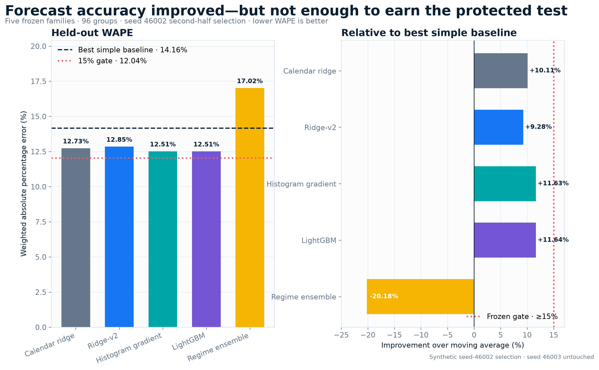

Overall held-out accuracy and the frozen 15% promotion threshold.

### 02 Event Peak Underprediction

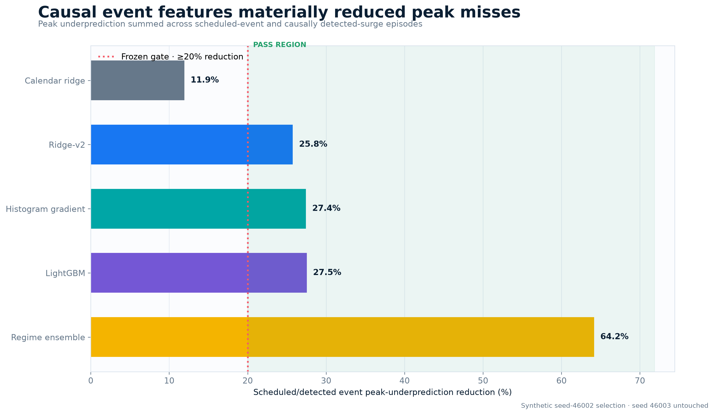

Scheduled/detected event peak-underprediction reduction.

### 03 P90 Coverage Calibration

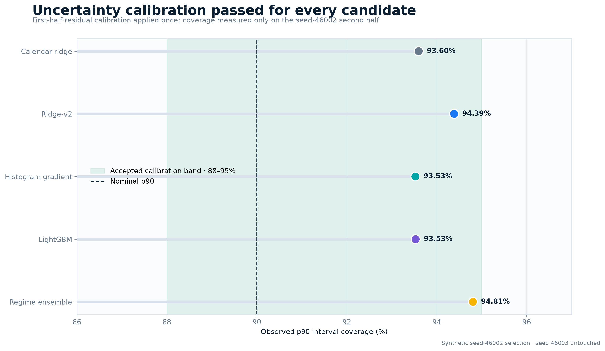

Observed p90 coverage against the accepted calibration band.

### 04 Worst Slice Guardrail

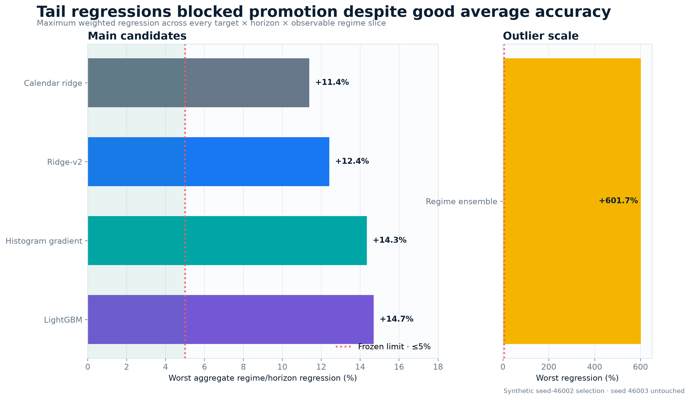

Worst aggregate regime/horizon regression that blocked promotion.

### 05 Fail Closed Gate Scorecard

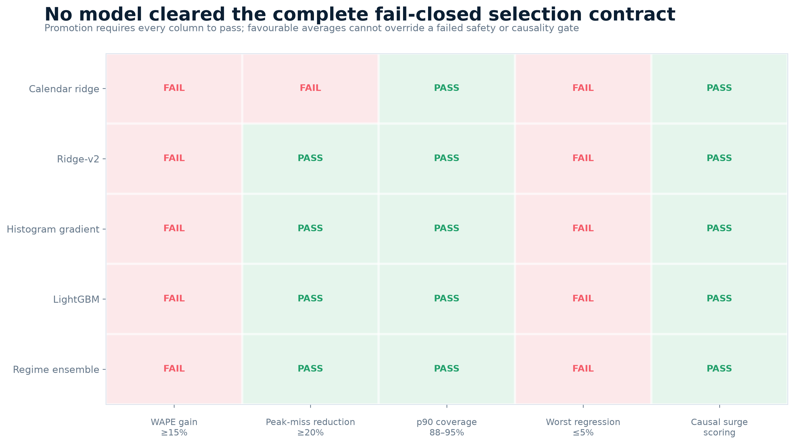

Gate-by-gate pass/fail scorecard.

### 06 Wape Improvement By Regime

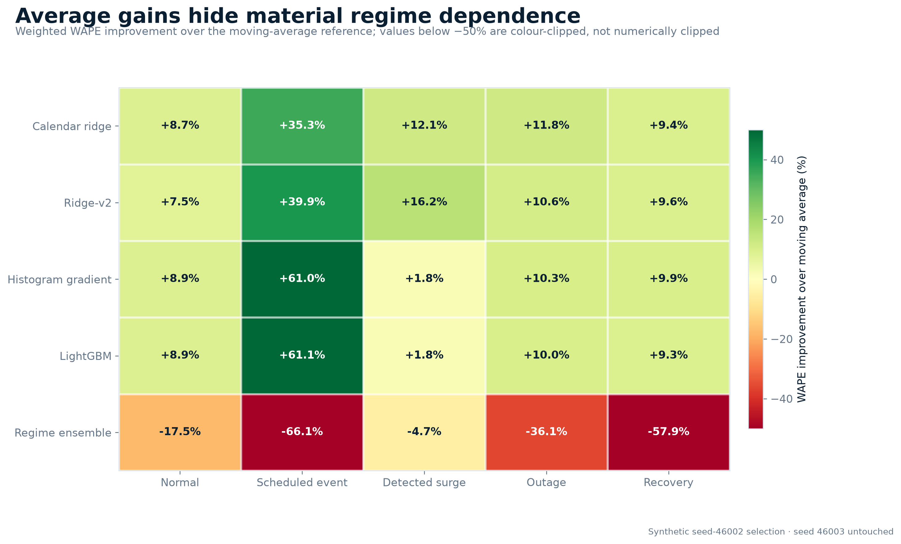

Per-regime WAPE improvement over moving average.

### 07 Wape Improvement By Horizon

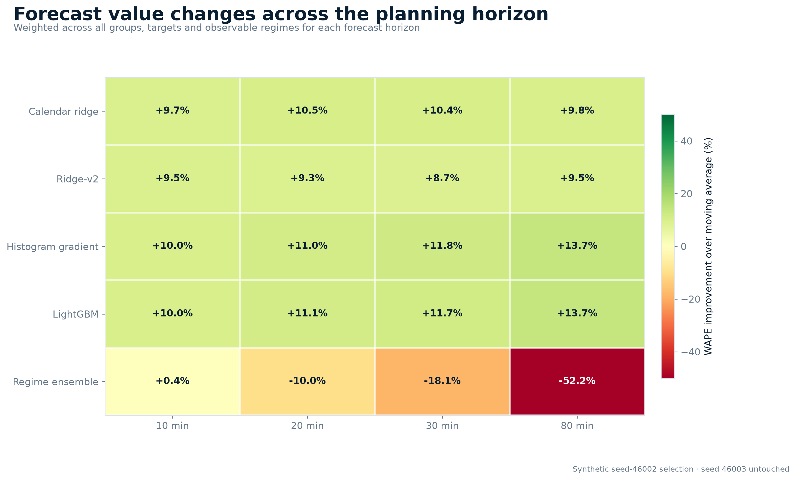

Per-horizon WAPE improvement over moving average.

### 08 Causal Unknown Surge Observability

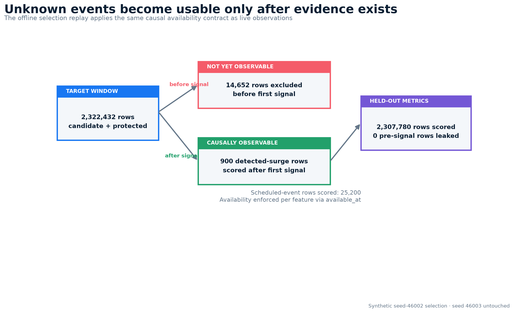

Causal availability and unknown-surge scoring exclusion.

### 09 Phase1 Plumbing And Reproducibility

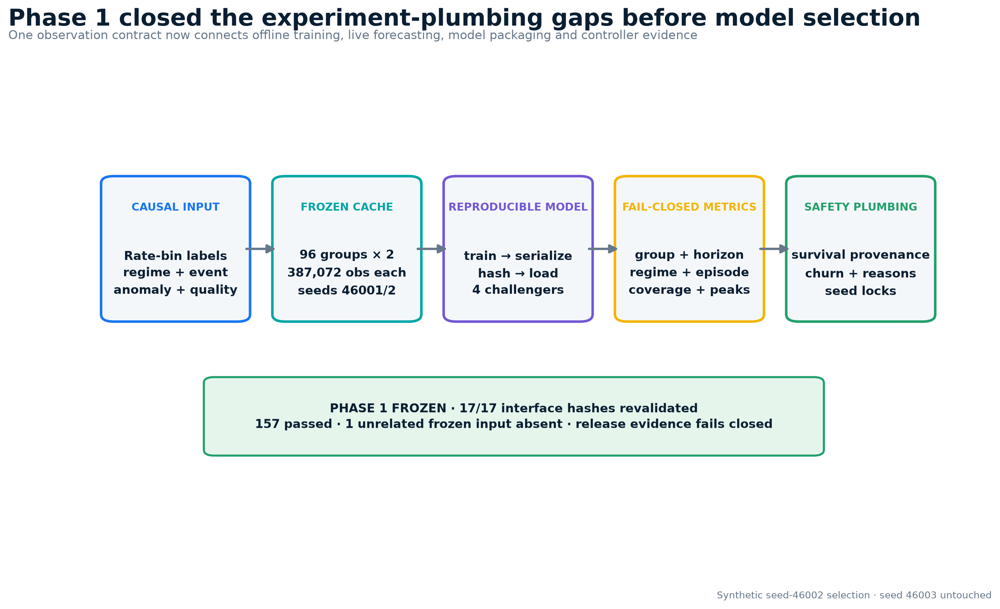

Phase-1 experiment plumbing and frozen interfaces.

### 10 Cluster Campaign And Artifact Scale

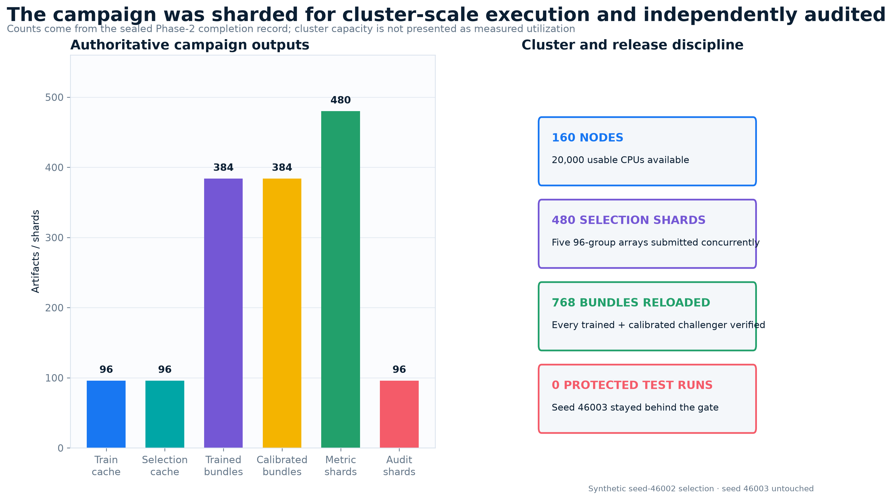

PBS campaign decomposition and artifact audit scale.

### 11 Guarded Hybrid Architecture

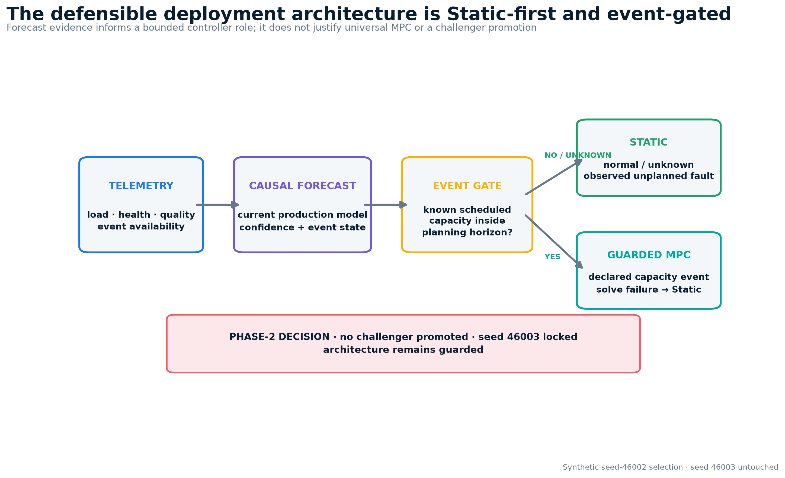

Static-first, scheduled-event-gated deployment architecture.

## Causal scoring and evidence integrity

- 14,652 pre-observation unknown-surge target rows were excluded per family.
- 900 detected-surge rows were scored only after the first observable signal.
- 2,307,780 held-out target rows were scored per family.
- All 17 frozen Phase-1 interface hashes were revalidated after the campaign.
- 384 trained and 384 calibrated bundles were checksum-loaded through the production loader.
- 480 group metric shards and 96 independent artifact-audit shards are sealed in the completion record.

## Presentation boundaries

- These are deterministic synthetic results, not C-DOT traffic calibration or live-network validation.
- Do not describe any forecast challenger as promoted.
- Do not describe seed 46003 as tested; it remains protected because selection failed.
- Empirical-survival outcome experiments are Phase 3 and are not claimed here.
- Static remains the production controller winner; guarded scheduled-event MPC remains the recommended next controller experiment.

## Authoritative inputs

- `../forecast-selection-v3.json` — complete model metrics and gates.
- `../phase2-completion-v3.json` — artifact counts, tree hashes and PBS job identities.
- `../phase1-freeze.json` — frozen interfaces, environment and seed policy.
