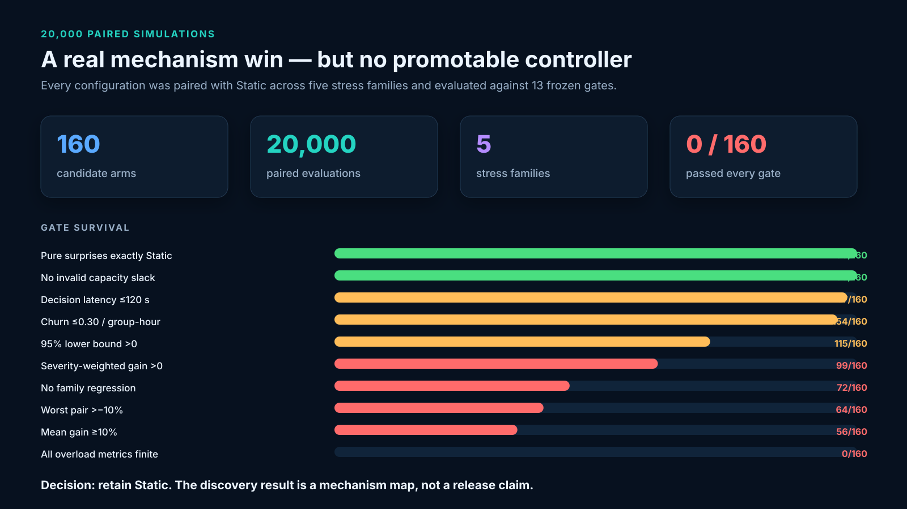
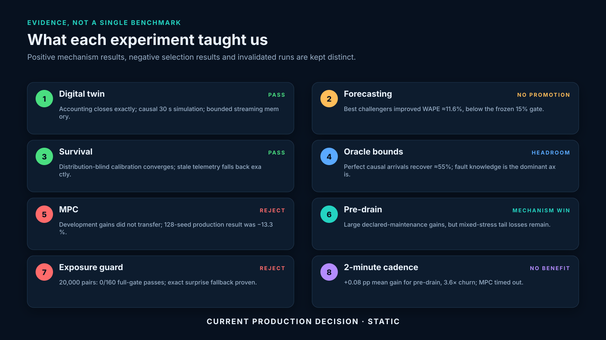
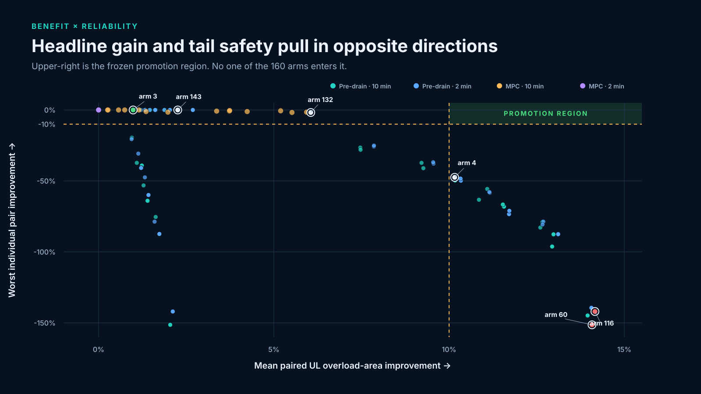
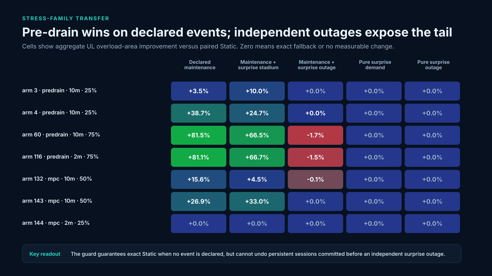
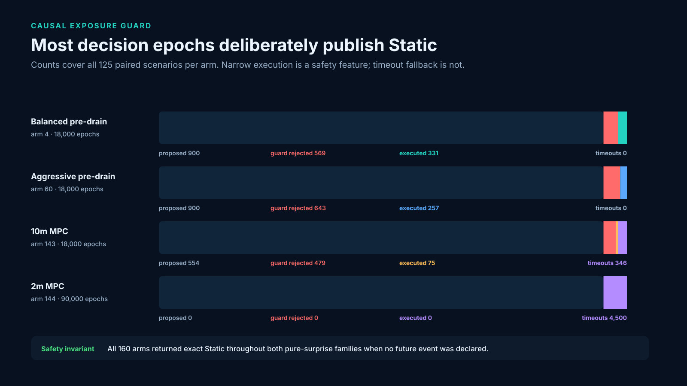
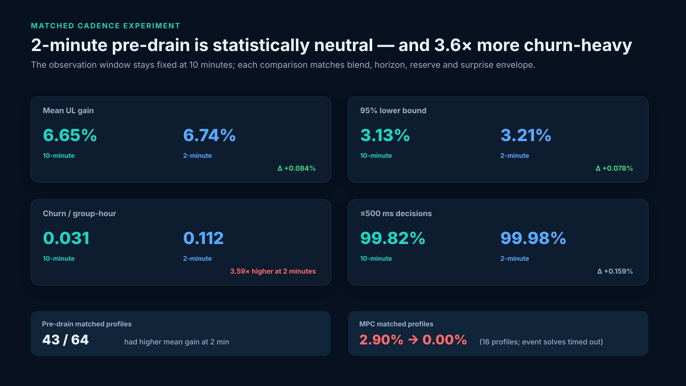

# C-DOT 5G optimizer experiment report

**Evidence cut:** 24 August 2026  
**Decision:** retain `static-capacity-v1` as the production controller  
**Claim boundary:** synthetic digital-twin and shadow-controller evidence; not a production-release claim

## Executive conclusion

The experiments found a genuine, reproducible control opportunity, but not yet a controller that is safe to promote.

Guarded pre-drain materially reduces uplink overload when a future capacity event is declared. In the completed 20,000-pair discovery campaign, the strongest 10-minute pre-drain profile reduced aggregate UL overload area by **81.47% on declared maintenance** and **66.45% on maintenance followed by a surprise stadium surge**. The corresponding mean-pair gains were 42.52% and 36.60%, with positive family-level bootstrap lower bounds.

That is not a mixed-stress win. The same aggressive profile regressed the independent-outage family by **1.70% aggregate**, had a **−151.35% worst individual pair**, and had negative severity-weighted gain. Across all 160 profiles, **zero passed the complete pre-registered gate**. Static therefore remains the defensible controller.

The faster-cadence hypothesis was also rejected. Across 64 matched pre-drain profiles, moving from 10-minute to 2-minute decisions changed average mean-pair gain from **6.651% to 6.735%**—only **+0.084 percentage points**—while increasing normalized churn from **0.0312 to 0.1121 L1 per group-hour**, or **3.59×**. All 2-minute MPC event solves timed out and fell back to Static.

The most useful C-DOT message is therefore:

> The digital twin can identify and quantify a large maintenance pre-drain opportunity. The current causal guard correctly prevents action on undeclared surprises, but it does not yet bound the tail created when long-lived sessions are committed before a later independent destination failure. The next research target is reversible or recourse-aware control—not another blend sweep or a faster loop.



## 1. What was built and tested

The program progressed through six linked questions:

1. Can the simulator represent national-scale, causal traffic without losing accounting integrity?
2. Can demand forecasts improve materially over simple causal baselines?
3. Can session survival be estimated without access to the simulator's hidden lifetime distribution?
4. Is there enough action-space headroom for optimization to matter?
5. Can deployable MPC or pre-drain realize that headroom without violating safety gates?
6. Can a causal exposure guard and faster cadence close the remaining mixed-stress tail?

The answer sequence was **yes, partially, yes, yes, not reliably, and not yet**.



## 2. Measurement contract

The primary controller metric is paired UL overload-area improvement:

```text
pair gain = (Static UL overload area − candidate UL overload area)
            / Static UL overload area
```

A positive value is better than Static. A negative value is a regression. When both paired results are exactly zero, the pair is treated as an exact tie. The campaign also reports:

- deterministic paired-bootstrap confidence intervals for mean-pair gain;
- severity-weighted/aggregate improvement so low-severity seeds cannot dominate the headline;
- family-level aggregate improvement;
- worst individual pair;
- DL overload, UL/DL drops, rejection and establishment-failure guardrails;
- solver status, capacity slack, fallback behavior, routing churn and end-to-end decision latency.

The final mixed-stress promotion gate required all of the following:

- mean-pair UL gain at least 10%;
- 95% confidence lower bound above zero;
- positive severity-weighted gain;
- no aggregate UL regression in any of five stress families;
- no aggregate secondary-metric regression;
- worst pair better than −10%;
- no solver timeout/error or invalid capacity slack;
- unexpected fallback below 1%;
- churn at most 0.30 L1 per group-hour;
- end-to-end decision time at most 120 seconds;
- exact Static behavior for pure surprises with no declared event;
- finite overload metrics throughout the evidence set.

This is intentionally stricter than selecting the arm with the largest average gain.

## 3. Experiment ledger and tested hypotheses

| Wave | Hypothesis | Experiment | Result | Decision |
|---|---|---|---|---|
| Digital-twin foundation | Offered traffic must reconcile exactly with carried, dropped, rejected and queued traffic. | Delhi traffic-realism evaluation | Maximum accounting residual 0; no ineligible or unhealthy placements. | Supported |
| Streaming scale | Long scenarios can execute with bounded memory and high cluster utilization. | Frozen 12-node production campaign | 384/384 shards in 85.4 min; 90.9% aggregate CPU efficiency; zero failures and zero swap. | Supported |
| Forecast challengers | A challenger improves six-window moving-average WAPE by at least 15% without slice regressions. | Phase 2, five model families | Best pooled improvement ≈11.64%; worst slices exceeded the 5% regression limit. | Rejected; no promotion |
| Survival estimation | Causal lifecycle telemetry is sufficient to recover load exposure. | Empirical survival, n=100/1,000/10,000 | Relative load-exposure error fell 4.25% → 1.50% → 0.42%. | Supported |
| Distribution blindness | Survival calibration generalizes across hidden lifetime families and drift. | Phase 3.1, 125 auditor trials | Mean MAE 2.92–4.17%; drift refresh improved 4.17% → 2.75%; stale fallback 100%. | Supported |
| Action-space headroom | New-session allocation can materially reduce overload in a continuous relaxation. | Extreme oracle bounds, two seeds | Perfect causal arrivals recovered ≈55.1% UL overload on average; scheduled-fault knowledge ≈67.7%; clairvoyant faults 100%. | Supported as non-deployable upper bound |
| Early MPC transfer | A development-selected MPC gain transfers to the production scenario. | 30-pair development vs 128-seed production | +18.76% development reversed to −13.30% production. | Rejected; distribution shift exposed |
| MPC ablations | Adaptive weighting, failure-domain awareness or churn triggers clear all gates. | Six 12-seed development ablations | No candidate cleared the full gate; intervals/tails/guardrails failed. | Rejected |
| Scheduled pre-drain | Declared future maintenance creates controllable pre-event headroom. | Phase 3.1 v1/v2 | Scheduled-fault reductions reached 79–83% in v1 and 43.89% for v2 blend 50%. | Mechanism supported |
| Fixed blend tradeoff | One fixed blend clears both 10% mean and −10% tail gates. | Phase 3.1 corrective v2 | 50%: 10.16% mean, −10.37% worst; 25%: 6.35% mean, −4.54% worst. | Rejected by 0.37 pp / insufficient mean |
| Instantaneous adaptive blend | Current residual utilization can taper actions before a later surprise. | Phase 3.2 | Surprise arrived after commitments; adaptive arms retained full strength and worst pair was −11.87%. | Rejected causally |
| Exposure guard | Deterministic surprise continuations eliminate unacceptable tail while preserving benefit. | Mixed-stress discovery v3, 160 arms | 0/160 passed; exact pure-surprise fallback worked, independent-outage tail remained. | Partially supported; no promotion |
| Faster pre-drain | 2-minute cadence yields at least 5% relative gain over matched 10-minute profiles with no tail cost. | 64 matched profile pairs | +0.084 pp average mean gain; 3.59× churn; no material family improvement. | Rejected |
| Faster MPC | 2-minute MPC fits the 120-second decision budget and improves control. | 16 matched profile pairs | Average max latency 87.1 s; all known-event solves timed out and returned Static; 0% gain. | Rejected |
| Pure-surprise neutrality | With no declared event, hybrid behavior is bit-exact Static. | Two pure-surprise families × all arms | 160/160 arms passed exact-Static gate. | Supported |
| Scenario informativeness | Every family creates useful Static overload on development seeds. | Mixed-stress scenario audit | Pure demand had 0/25 informative pairs per arm; declared/stadium families had 11/25; outage emitted non-finite overload. | Rejected; redesign required |
| Real-trace transfer | Frozen synthetic bundles can directly produce a deployable C-DOT policy. | First C-DOT metrics replay | Group identity/history/capacity semantics do not match; only a provisional advisory was defensible. | Rejected pending calibration |

## 4. Digital-twin and cluster-scale evidence

The Delhi realism evaluation established the foundation needed for controller comparisons:

- 30-second causal simulation steps;
- 96 modeled traffic groups across eight service families;
- zero accounting residual in UL and DL;
- zero ineligible and zero unhealthy placements;
- statistically checked traffic rates, burst dwell and holding-time quantiles;
- explicit claim boundary: standards-grounded synthetic modeling, not calibrated production traffic.

The frozen production-scale campaign then completed **384 shards on 12 nodes** in **5,122.5 seconds (85.4 minutes)** at **90.9% aggregate CPU efficiency**, with **zero worker failures, zero establishment failures and zero swap**. This proves the experiment platform can run deterministic, paired campaigns at meaningful scale. It does not prove a controller is beneficial.

The 128-seed production controller comparison was unfavorable to optimization. Static is normalized to 100; the median MPC UL-overload score was 113.05 and the mean paired improvement was −13.30%. Reactive thresholding was substantially worse again. This larger, fixed-scenario result is authoritative over the earlier candidate-selection result.

## 5. Forecast experiments

The Phase 2 comparison used a common six-window moving-average reference at **14.160% WAPE**.

| Candidate | WAPE | Improvement vs baseline | p90 coverage | Peak improvement | Worst slice | Promoted? |
|---|---:|---:|---:|---:|---:|:---:|
| Calendar ridge | 12.729% | 10.11% | 93.60% | 11.93% | 11.39% regression | No |
| Histogram-gradient quantile | 12.513% | 11.63% | 93.53% | 27.44% | 14.34% regression | No |
| LightGBM quantile | 12.512% | 11.64% | 93.53% | 27.54% | 14.70% regression | No |
| Regime ensemble | 17.017% | −20.18% | 94.81% | 64.16% | 601.67% regression | No |
| Ridge v2 | 12.846% | 9.28% | 94.39% | 25.76% | 12.42% regression | No |

The nonlinear models clearly improved both pooled WAPE and peak underprediction, but the frozen contract required a 15% WAPE improvement and no aggregate regime/horizon regression above 5%. No model qualified, so protected forecast seed `46003` was not used.

The important scientific result is that better forecasting is not identical to better control. The oracle experiments later showed that uncertainty about future capacity failures, not marginal demand-forecast accuracy, is the dominant controller limitation.

## 6. Session-survival experiments

The empirical survival fitter consumed only causal lifecycle export records: session ID, group, service class, start time, observed end or censor time and timestamps. It did not access the simulator's hidden lifetime family.

| Per-group target | Lifecycles | Load-exposure error | Mean calibration error | Max group/horizon error |
|---:|---:|---:|---:|---:|
| 100 | 9,600 | 4.25% | 3.10% | 18.80% |
| 1,000 | 96,000 | 1.50% | 1.08% | 6.23% |
| 10,000 | 960,000 | 0.42% | 0.33% | 1.93% |

The independent distribution-blind campaign ran 25 trials in each of five hidden regimes: uniform, Weibull, lognormal, heavy-tail mixture and distribution drift. All 125 trials completed. Mean calibration MAE ranged from 2.92% to 4.17%; every stale bundle failed closed, sparse-group pooling was exercised in every regime, and post-drift refresh reduced mean MAE from 4.17% to 2.75%.

Closed-loop MPC sensitivity remained small or neutral, so this is evidence that the estimator works—not evidence that MPC should be deployed.

## 7. Oracle and controllability experiments

The controllability surface explains the entire controller story. At zero notice, new-session-only routing can steer **0%** of already established load. With longer notice, the steerable fraction rises; with longer session lifetimes, it falls.

In two one-day continuous-relaxation upper-bound scenarios:

| Information regime | Mean UL overload reduction vs Static | Interpretation |
|---|---:|---|
| Perfect causal arrivals, causal faults | 55.13% | Demand knowledge alone leaves a large residual |
| Scheduled-fault knowledge | 67.71% | Notice increases controllable load |
| Clairvoyant fault knowledge | 100.00% | Fault uncertainty is the binding information gap |
| 10% bounded migration per bucket | 100.00% | Reversible recourse removes the persistence barrier in this relaxation |

These are non-deployable upper bounds, not controller results. Their value is diagnostic: they prove optimization headroom exists and identify future-fault knowledge or reversible recourse as the axis that matters.

## 8. Controller development before the 160-arm campaign

### 8.1 MPC development-to-production reversal

The early 30-pair development campaign reported **+18.76% mean improvement**, with a 95% interval of **[6.63%, 32.59%]**. The frozen 128-seed production contract reported **−13.30%**, with interval **[−14.44%, −12.20%]**.

The reversal was not a reproducibility failure. The model, controller profile and UL metric matched; the scenario distributions did not. Development was a four-stressor selection set whose gain was driven by scheduled faults. Production was one fixed extreme scenario. The larger campaign exposed the distribution shift and overruled the development claim.

### 8.2 Pre-drain benefit/tail frontier

Phase 3.1 v1 showed large mean gains—18.41% and 18.97%—and scheduled-fault reductions of 79.20% and 83.05%. Both candidates regressed severity-weighted mixed stress and failed the tail/churn gates.

The corrective v2 experiment isolated the core tradeoff:

| Pre-drain blend | Mean-pair UL | Bootstrap 95% | Scheduled-fault gain | Worst pair | Result |
|---:|---:|---:|---:|---:|---|
| 50% | 10.16% | [0.99%, 21.92%] | 43.89% | −10.37% | Failed only tail gate, by 0.37 pp |
| 25% | 6.35% | [0.66%, 14.19%] | 26.76% | −4.54% | Failed only 10% mean gate |

Phase 3.2 tested fixed 35/40/45% and two utilization-tapered 25–50% profiles. No candidate reached 10% mean gain and every confidence interval crossed zero. The adaptive policy could not anticipate a surprise arriving after long-lived sessions had already been committed, so it did not protect the worst mixed-stress pair. That result closed the simple interpolation hypothesis.

## 9. The guarded 160-arm mixed-stress campaign

### 9.1 Design

Each profile was evaluated on 125 fresh paired scenarios: 25 seeds in each of five families.

1. Declared maintenance.
2. Unannounced demand surge.
3. Unannounced outage.
4. Declared maintenance followed by a surprise stadium-style upload surge.
5. Declared maintenance followed by an independent surprise UPF outage.

The 128 pre-drain arms crossed cadence (10/2 min), maximum blend (25/35/50/75%), horizon (1/2/3/4 h), destination reserve (70/80%) and surprise-capacity factor (45% brownout/1% outage). The 32 MPC arms crossed cadence, horizon, blend, reserve and surprise envelope.

The exposure guard compared every proposed action with contemporaneous Static over the declared-event horizon, then evaluated deterministic demand-shock and single-destination-loss continuations. It reduced blend strength when possible and otherwise published exact Static. The actual future was never inspected.

### 9.2 Execution integrity

- Smoke job: 125/125 workers completed with exit status 0.
- Discovery array: 160/160 arms completed.
- PBS shape: `0-159%120`, capped at 120 concurrent exclusive nodes; each element requested 125 CPUs and 120 GB and launched 125 single-thread workers.
- Fresh candidate evaluations: 20,000/20,000.
- Unique cached Static references: 250.
- Error-log signatures: zero in the valid v3 campaign.
- Pure-surprise exact-Static gate: 160/160 arms.
- Invalid capacity slack: zero for all 160 arms.
- Work fingerprint: `f36fe39a3b5c3d54501c4b8389dd7fb8f9e310312df7b145d4b07b115d58ad34`.
- Input-inventory SHA-256: `04258449c3e22de762ed20374afcd7cf58afb037a0e4b4e0c1cef7ad306782d0`.

Two earlier cluster attempts are retained for audit but excluded from science:

| Attempt | Partial shards | Failure | Evidence status |
|---|---:|---|---|
| `guarded-v1` | 7,007 / 20,000 | Static-cache fingerprint collision after cadence normalization | Invalid; never aggregate |
| `guarded-v2` | 8,952 / 20,000 | Guard rejection serialized as invalid solver status `rejected` | Invalid; stopped and preserved |
| `guarded-v3` | 20,000 / 20,000 | No job failure; later evidence-quality caveats remain | Valid discovery execution |

### 9.3 Gate survival

| Gate | Arms passing | Interpretation |
|---|---:|---|
| Pure surprise exactly Static | 160 / 160 | Safety behavior works |
| No invalid capacity slack | 160 / 160 | Flow-capacity rejection works |
| Decision latency ≤120 s | 157 / 160 | Three profiles exceeded budget |
| Churn ≤0.30/group-hour | 154 / 160 | Six aggressive profiles exceeded budget |
| 95% lower bound >0 | 115 / 160 | Many mean effects are statistically positive |
| No solver timeout/error | 127 / 160 | MPC remains operationally fragile |
| No secondary aggregate regression | 122 / 160 | Most, not all, preserve secondary metrics |
| Severity-weighted gain >0 | 99 / 160 | Headline mean often hides severity loss |
| No family aggregate UL regression | 72 / 160 | Independent outage is the main blocker |
| Worst pair >−10% | 64 / 160 | Tail risk is widespread |
| Mean-pair gain ≥10% | 56 / 160 | Benefit alone is not rare |
| All overload metrics finite | 0 / 160 | Surprise-outage health semantics invalidate full aggregation |
| **All gates together** | **0 / 160** | **No validation candidate** |

Even when the finite-metric gate is temporarily removed for diagnosis, no arm clears the remaining complete core gate. The conclusion therefore does not depend on that one evaluator defect.



### 9.4 Representative profiles

| Arm | Profile | Mean pair | 95% lower | Severity weighted | Worst pair | Churn / group-hour | Readout |
|---:|---|---:|---:|---:|---:|---:|---|
| 3 | Pre-drain, 10m, 25%, 1h, 80%, 1% | 0.99% | 0.24% | 0.15% | 0.00% | 0.0060 | Safe/conservative; insufficient gain |
| 4 | Pre-drain, 10m, 25%, 2h, 70%, 45% | 10.16% | 5.58% | 0.51% | −47.46% | 0.0247 | Closest headline profile; tail fails |
| 60 | Pre-drain, 10m, 75%, 4h, 70%, 45% | 14.08% | 7.37% | −0.46% | −151.35% | 0.0803 | Best showcase mechanism; unsafe |
| 116 | Pre-drain, 2m, 75%, 2h, 70%, 45% | 14.16% | 7.55% | −0.33% | −141.97% | 0.3131 | Highest mean; tail/family/churn fail |
| 132 | MPC, 10m, 50%, 1h, 70%, 45% | 6.05% | 2.61% | 0.01% | −1.78% | 0.0047 | Best mean MPC; outage/secondary/solver gates fail |
| 143 | MPC, 10m, 50%, 2h, 80%, 1% | 2.26% | 0.84% | 0.57% | 0.00% | 0.0059 | Safe tail; 346 event-solve timeouts |
| 144 | MPC, 2m, 25%, 1h, 70%, 45% | 0.00% | 0.00% | 0.00% | 0.00% | 0.0028 | Event solves time out; exact Static |

For arm 60, family-level mean-pair gains were **42.52%** for declared maintenance and **36.60%** for maintenance plus stadium; bootstrap lower bounds were **24.00%** and **20.47%**. These are the strongest reliable positive mechanism results in this campaign. They must be presented beside the negative independent-outage and worst-pair results.



### 9.5 Why the guard did not eliminate the independent-outage tail

The guard tests deterministic hypothetical continuations at each decision. It can reject a proposal if a tested destination loss is immediately worse than Static. It cannot revoke admissions already assigned by earlier accepted policies. When maintenance pre-drain moves long-lived sessions toward a destination and a different independent outage happens later, those sessions persist. A later exact-Static fallback changes only new admissions; it does not migrate the committed cohort.

This is the same causal boundary predicted by the controllability surface. The guard reduces exposure, but without reversible recourse it cannot provide a universal tail guarantee over all later surprise timings.

### 9.6 Guard action funnel

Across a representative 10-minute, 25%-blend arm, 18,000 decision epochs led to 900 proposals and 331 executed policies; 569 proposals were rejected because the declared-event projection did not improve UL overload. For aggressive arm 60, 900 proposals produced 257 executions and 643 guard rejections. This selectivity is expected.

For 2-minute MPC, the funnel is qualitatively different: all 4,500 known-event solves per arm timed out and no optimized policy executed. The fallback was safe, but the mechanism did not run successfully.



## 10. Two-minute versus ten-minute cadence

The observation window was held fixed at 10 minutes. Only controller cadence changed, so the comparison did not inject extra forecast noise.

### 10.1 Matched pre-drain profiles

| Metric, average over 64 matched profiles | 10-minute | 2-minute | Difference |
|---|---:|---:|---:|
| Mean-pair UL gain | 6.651% | 6.735% | +0.084 pp |
| Bootstrap 95% lower bound | 3.131% | 3.209% | +0.078 pp |
| Severity-weighted gain | −0.061% | −0.038% | +0.022 pp |
| Worst-pair gain | −58.75% | −57.26% | +1.49 pp |
| Declared-maintenance aggregate gain | 34.581% | 34.467% | −0.114 pp |
| Maintenance + stadium aggregate gain | 32.990% | 33.151% | +0.161 pp |
| Maintenance + outage aggregate gain | −0.652% | −0.619% | +0.032 pp |
| Churn L1 / group-hour | 0.0312 | 0.1121 | **3.59×** |
| Mean of maximum decision latency | 674 ms | 646 ms | −28 ms |
| Decisions within aspirational 500 ms | 99.82% | 99.98% | +0.16 pp |

Two-minute cadence had higher mean gain in 43 of 64 matches, but the effect was only 0.084 percentage points, far below the pre-registered 5% relative-improvement hypothesis. It did not improve declared maintenance and did not remove the independent-outage regression. The small average change is not operationally worth 3.6× churn and five times as many decision epochs.

### 10.2 Matched MPC profiles

| Metric, average over 16 matched profiles | 10-minute | 2-minute |
|---|---:|---:|
| Mean-pair UL gain | 2.898% | 0.000% |
| Bootstrap lower bound | 1.257% | 0.000% |
| Severity-weighted gain | 0.218% | 0.000% |
| Mean of maximum latency | 19.35 s | 87.14 s |
| Declared-maintenance aggregate gain | 14.154% | 0.000% |
| Maintenance + stadium aggregate gain | 12.965% | 0.000% |

All 72,000 known-event solves across the sixteen 2-minute MPC arms timed out and published Static. These decisions stayed within 120 seconds on average but were not usable optimization outcomes. Three arms also exceeded the hard 120-second maximum.



## 11. Evidence-quality findings and limitations

### 11.1 Non-finite outage metrics

The pure surprise-outage scenario represents an unavailable UPF with an infinite overload value. Static and hybrid are exact behavioral matches, so the safety conclusion is clear, but arithmetic over infinity is not a valid finite severity total. Consequently all 160 arms fail the `all_overload_metrics_finite` gate.

The compact v2 analysis handles exact paired infinities as neutral ties for pair-level diagnostics and separately marks the finite-evidence failure. No production claim should use the overall severity-weighted result until the unavailable-state metric is replaced by a finite service-impact measure or capped contract.

### 11.2 Weak scenario informativeness

- Pure demand surprise: 0 of 25 Static seeds had positive UL overload per arm.
- Declared maintenance: 11 of 25 informative Static pairs per arm.
- Maintenance plus stadium: 11 of 25 informative Static pairs per arm.
- Maintenance plus outage: 25 of 25 informative pairs.
- Pure outage: 25 of 25 behaviorally informative pairs, but overload is non-finite.

The pure-demand family proves exact fallback but cannot measure benefit. Future scenario generation should calibrate stress severity using a disjoint development pool until a required fraction of Static seeds has finite, positive overload.

### 11.3 Discovery is not validation

All 160 profiles were inspected on development seeds. Because none passed the frozen gate, no profile was frozen for the planned 2,500-pair validation wave or the 20,000-pair C-DOT holdout demonstrations. Running those holdouts now would be both expensive and scientifically unjustified.

Protected seeds `46003`, `46201–46216` and `46301–46330` remain untouched.

## 12. First C-DOT real-metrics replay

The first real trace covered four hours and 23 complete 10-minute windows. It did not match the synthetic model's 96 group identities, 144-window history, or calibrated session/capacity semantics. A short-history replay was still possible:

| Causal reference | One-step carried-PPS WAPE |
|---|---:|
| Last value | 23.09% |
| Moving average 3 | 18.97% |
| Moving average 6 | 19.78% |
| Seasonal naive / 3 | 13.30% |

The topology-only 1:2:3:2 UPF weighting was a provisional advisory, not an automatically deployable policy. Blocking findings included zero classified traffic for TAC 1, 42.8% apparent traffic on forbidden UPF/TAC pairs under literal labels, active-session gauge resets, absent `smf.yaml`, and missing packet-size/session-lifecycle/capacity calibration. An inferred UPF-label permutation reduced the topology contradiction to zero, but C-DOT must confirm identities rather than relying on that inference.

## 13. What can be shown to C-DOT

### Defensible positive claims

- The synthetic digital twin closes traffic accounting exactly and runs reproducibly at cluster scale.
- Causal, distribution-blind survival estimation converges with telemetry volume and fails closed when stale.
- Oracle studies prove substantial optimization headroom and identify capacity-event knowledge as the dominant information axis.
- Guarded pre-drain reliably improves the declared-maintenance and maintenance-plus-stadium families in discovery.
- Every pure-surprise profile returns exact Static when no future event is declared.
- The campaign exposed failure modes before production, which is precisely the value of the digital twin.

### Claims that must not be made

- “The optimizer beats Static across mixed stress.” It does not pass the complete gate.
- “Arm 60 is production safe.” Its worst pair and independent-outage aggregate are unacceptable.
- “Two-minute control is better.” The measured gain is negligible and churn is much higher.
- “MPC works at two-minute cadence.” It timed out and fell back.
- “All five families were well calibrated.” Pure-demand overload was uninformative and outage metrics were non-finite.
- “The results transfer directly to C-DOT production.” The real trace lacks required identity and capacity semantics.

## 14. Recommended next experiments

1. **Replace irreversible pre-drain with recourse-aware control.** Test short-lived admission epochs, bounded migration, or an explicit recourse reserve. The oracle result says this targets the binding mechanism.
2. **Make outage impact finite.** Define overload/service-unavailability accounting that remains finite when capacity is zero, then rerun aggregation tests before consuming new seeds.
3. **Calibrate family informativeness before controller evaluation.** Require a pre-registered fraction of finite, positive Static overload using separate scenario-development seeds.
4. **Retain 10-minute cadence for pre-drain.** The 2-minute cadence hypothesis is closed unless a new reversible mechanism specifically benefits from faster recourse.
5. **Do not run 2-minute MPC without model reduction.** First demonstrate worst-case end-to-end latency well below 120 seconds on one node and under saturation.
6. **Request the missing C-DOT telemetry contract.** Canonical UPF identities, SMF normalization semantics, per-class create/delete counters, 5QI, byte/packet rates, lifecycle/age buckets and calibrated directional/session capacity are prerequisites.
7. **Use fresh validation only after a development pass.** Freeze code, scenario, candidate and seed hashes before validation; do not tune after looking at it.

## 15. Reproducibility map

| Evidence | Source |
|---|---|
| Mixed-stress compact analysis | `output/mixed-stress-discovery-v3-analysis-v2.json` |
| Analysis implementation | `experiments/analyze_mixed_stress_discovery.py` |
| Campaign implementation | `experiments/mixed_stress_campaign.py` |
| Cadence pre-registration | `FUTURE_PLAN.md` |
| Forecast Phase 2 report | `output/control-science/v1/forecast-phase2/REPORT.md` |
| Empirical survival report | `output/control-science/v1/survival-phase3-v1/REPORT.md` |
| Distribution-blind survival | `output/control-science/v1/phase3.1-survival-v1/REPORT.md` |
| Corrective pre-drain/MPC v2 | `output/control-science/v1/phase3.1-development-v2/REPORT.md` |
| Adaptive pre-drain experiment | `output/control-science/v1/phase3.2-development-v1/REPORT.md` |
| Frozen production metrics | `output/showcase/cdot-production-final/metrics.json` |
| Oracle bound | `output/models/extreme-oracle-bound-evaluation-v1.json` |
| Traffic realism | `output/delhi/traffic-realism-v2-evaluation.json` |
| First real C-DOT replay | `output/cdot-real/2026-08-20-first-drop/REPORT.md` |
| Figure builder | `presentation/build_cdot_experiment_report.py` |
| Compact figure data | `presentation/cdot-experiment-report-v2/data/mixed-stress-summary.json` |
| Artifact hashes | `presentation/cdot-experiment-report-v2/artifact-manifest.json` |

The large raw campaign directory remains intentionally ignored by Git. This report, its compact data and its vector figures are small, reviewable and suitable for version control.
